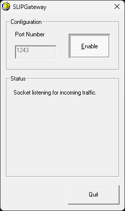

# SLIPGateway
Greg Kennedy 2025

## Overview
SLIPGateway is a Win32 application, written in Visual C++ 6.0, for routing SLIP-over-IP connections to the Internet.  It might also be called a "proxy", "router", "NAT", "mini ISP", "bridge" etc. for SLIP connections.

SLIP, the [Serial Line Internet Protocol](https://en.wikipedia.org/wiki/Serial_Line_Internet_Protocol), is a very simple protocol for sending Internet packets across a dedicated serial link.  It was used for fixed number dial-up modems, but later superseded by PPP ("point-to-point protocol"), which offered more features like IP auto-assignment and user authorization.  The advantage of SLIP is its simplicity, which is why this program does not support any other protocol.

At first glance this seems completely useless.  If your target machine can already talk IP, what is the sense of encoding those packets via SLIP and sending them to another system for routing?  But there is actually at least one useful consumer of this: emulators such as DOSBox, which [simulate a virtual modem](https://www.vogonswiki.com/index.php/DOSBox_modem_emulation) as a TCP connection.  The "modem" sends its bytes to a listener - normally another virtual modem - but with a program to unwrap SLIP and place the packets onto a network, it is possible to get the emulator online.

## How to Use
1. Download a Release of SLIPGateway on the "releases" section on the right.
2. Launch SLIPGateway.exe.  Click the "Enable" button to begin listening for virtual modem calls on the specified port.
3. From your emulator, use a Dialer program to call your localhost IP and port.  This requires a Hayes command like `ATDT 1270000000011243`.  Consult the DOSBox Virtual Modem guide for more information.  For example, [Trumpet Winsock](https://en.wikipedia.org/wiki/Trumpet_Winsock) can dial modems and supports SLIP under Windows 3.x.
4. Browse the Internet like it's 1994.

## How It Works
SLIPGateway listens for incoming connections on a port.  Once accepted, packets from the sender are parsed, to retrieve the address / port information and payload as the destination.  SLIPGateway then opens its own connection to the destination, passing along the packet information.  When a remote system responds, SLIPGateway captures the data and then inserts new SLIP packets back to the local machine.  In other words, it is a middleman for connections, repeating the data from each side to the other.

Why this approach instead of simply using raw socket functions to alter the headers?  A few reasons:
* raw sockets require administrator access on modern Windows systems
* danger of port collision between the host and its proxied client

## Limitations
SLIPGateway supports only UDP and TCP connections - all others are dropped.  For now, ICMP ECHO ("ping") is supported, but SLIPGateway fakes replies itself rather than attempting to replicate the packets.  Thus, "ping" always succeeds, and "traceroute" doesn't work, etc.

Port forwarding is not supported.

Multiple client connections at once works, but there is no simulated LAN or local routing: connecting two clients to one SLIPGateway won't allow them to send packets to each other.

A lot of edge cases with TCP connections need to be worked out.  In particular, sequence-number rollover, TCP retransmission to connected clients, FIN handling (everything just RST currently), all not handled right.

But hey, you can telnet to your favorite BBS.
